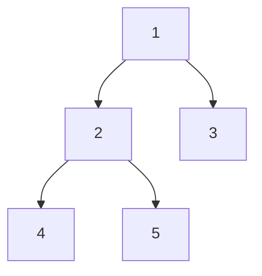

# Binary Tree

Implementation of Binary Tree data structure in c++.

Each node in the tree has maximum of 2 children nodes. Referred to as right and left child respectively.

Two possible implementations:
- Linked Node objects
- Array

## Terminology

- **Tree**:
- **Binary tree**: The data structure itself. It's a special type of Tree data structure. Which itself is a special type of Graph data structure.
- **Node**: The element of the tree. It holds data (either plain or with key) and has up to 2 children. In some implementations node also points back to its parent.
- **Parent**
- **Child**
- **Sibling**: Nodes having the same parent are siblings.
- **Degree**: Number of children of a node.
- **Edge**
- **Path**: A sequence of nodes n1, n2,...,nk such that ni is a parent of n(i+1) for 1 <= i <= k. **Length** of this path is k-1.
- **Ancestor and Descendant**: There is a path between an ancestor and its descendants.
- **Depth**:
  - of node: The length of a path from root to a node.
  - of tree: The maximum node depth.
- **Level**: All nodes of the same depth are said to be on the same level.
- **Height**: Property of a node, equal to number of levels of a subtree with this node as a root. E.g. node with no children (leaf) has height equal to 1. Node with only leaf children has height of 2.
- **Skew**: The difference of the height of node's right child and it's left child. Also known as **Balance Factor**. Skew ∈ {-1, 0, 1} means node is balanced. Otherwise its skewed or unbalanced.
  - **Left Heavy**: node with skew < 0.
  - **Right Heavy**: node with skew > 0.
- **Internal node**: A node that has at least one child.
- **Leaf node**: A node with no children. Also referred to as external node.
- **Enumeration**: A traversal that visits each node exactly once.

## Traversals

Example tree:

### Recursive

Best implemented using recursion. Base case: node if a leaf.

| Name       | Scheme            | Example       |
|------------|-------------------|---------------|
| In-order   | Left, root, right | 4, 2, 5, 1, 3 |
| Pre-order  | Root, left, right | 1, 2, 4, 5, 3 |
| Post-order | Left, right, root | 4, 5, 2, 3, 1 |

### Non-recursive

Implementation usually does not use recursion. A queue is used to keep track of nodes and it's children.

- Level-order: Level by level from left to right. Yields 1, 2, 3, 4, 5.

## Tree types

- `n` total number of nodes
- `ì` number of internal nodes
- `l` number of leaves
- `λ`number of levels (starting at 0)

### Full Binary Tree

Every parent has either 0 or 2 children. Also known as Proper Binary Tree.

- `l = i + 1` or `l = 1/2(n + 1)`
- `n = 2i + 1` or `n = 2l - 1`
- `i = 1/2(n - 1)` or `i = l - 1`
- `l` is at most `2 to the power of (λ - 1)`

### Balanced Binary Tree

The difference og height of left and right subtrees is less than one. And both subtrees of all nodes are balanced.

The height of a balanced tree is and the number of nodes are logarithmically proportional.

### Complete Binary Tree

Every level, except possibly the last, is completely filled and all nodes at the last level are as far left as possible.

Every complete tree is balanced.

Complete Tree can be stored in array without empty spaces. For node at index `i` its left child as at `2i + 1` and its right child at `2i + 2`.

| level | 0 | 1 | 1 | 2 | 2 | 2 | 2 | 3 | 3   |
|-------|---|---|---|---|---|---|---|---|-----|
| Index | 0 | 1 | 2 | 3 | 4 | 5 | 6 | 7 | ... |

### Perfect Binary Tree

All parents have exactly 2 children and all leaves are on the same level. Every perfect tree is full, complete and balanced.

- `l = 2 to the power of λ`
- `λ = log(n + 1) - 1`
- `n = 2 to the power of (λ + 1) - 1`

## Data for testing purposes

| File     | Comment               | Array representation          |
|----------|-----------------------|-------------------------------|
|tree_1.tr | Simple test tree      | 1 2 4 # # 5 # # 3 # #         |
|tree_2.tr | Example full tree     | 1 2 4 # # 5 6 # # 7 # # 3 # # |
|tree_3.tr | Example perfect tree  | 1 2 4 # # 5 # # 3 6 # # 7 # # |
|tree_4.tr | Example complete tree | 1 2 4 # # 5 # # 3 6 # # #     |

# Huffmann Tree

Not sure if this is the correct name. But it's the data structure wee need to use to implement Huffmann Encoding. In such a tree internal nodes do not hold data, only some sort of key, and provide structure to the tree. All usable data are stored in leaf nodes.

## Sources

- [OpenDSA](https://opendsa-server.cs.vt.edu/ODSA/Books/CS3/html/Huffman.html)

# Binary Search Tree

Elements in **BST** are ordered by a **key** value. This means that BST can only stores data that can be compared using the **<** operator.

For classes that are to be stored in a tree, we can override the <=> operator. This operator is called *a spaceship* and is the preferred way of creating comparable classes.

 All elements in node's left sub-tree are smaller equal than the element in the node. All elements in its right sub-tree are larger than key in the node.

 In-order traversal traverses all the nodes in sorted order from smallest to largest.

 ## Complexity

 ## Sources

 - [Wikipedia](https://en.wikipedia.org/wiki/Binary_search_tree)
 - [Programiz](https://www.programiz.com/dsa/binary-search-tree)
 - [OpenDSA](https://opendsa-server.cs.vt.edu/ODSA/Books/CS3/html/BST.html)

 # AVL

 A type of self-balancing binary search tree. Note that during the balancing act, the *binary search tree* property can be violated, if there are duplicated keys in the tree. (To demonstrate this situation, try, for example, inserting only one value into the AVL tree multiple times.) This violation, however, doesn't seam severe; It jus might happen that node's right child is equal to this node. In-order traversal still accesses elements ordered from smallest to largest.

## Balancing

While balancing, we are not directly interested in node's height. What is of interest and use to us is only the Skew of a node. After insertion of new node or removal of existing node, we must check all nodes on the path we traversed and balanced those that became unbalanced by our actions. The balancing is done by one of 4 types of rotations: Left, Right, Right-Left, Left-Right.

### Rotations

- **Left** when node is unbalanced and right heavy (skew >= 2).
  - **Right-Left** if node's right child is left heavy (skew <= -1) first rotate this child right.
- **Right** when node is unbalanced and right heavy (skew <= -2).
  - **Left-Right** if node's left child is right heavy (skew >= 1) first rotate this child left.

#### Rotation Diagrams

| Left | Right-Left | Right | Left-Right |
|---|---|---|---|
|  |  |  |  |
| Root node **5** is unbalanced with skew +2. It's right child **6** is not left heavy (it's skew is +1), so no need for double rotation. | Root node **5** is unbalanced with skew +2. It's right child **10** is left heavy (it's skew is -1). This creates a *zig-zag* pattern. We first rotate **10** to the right and only then the root to the left. | Root node **7** is unbalanced with skew -2. It's left child **6** is not right heavy (it's skew is -1), so no need for double rotation. | Root node **10** is unbalanced with skew -2. It's left child **5** is right heavy (it's skew is +1). This creates a *zig-zag* pattern. We first rotate **5** to the left and only then the root to the right. |

## Sources
